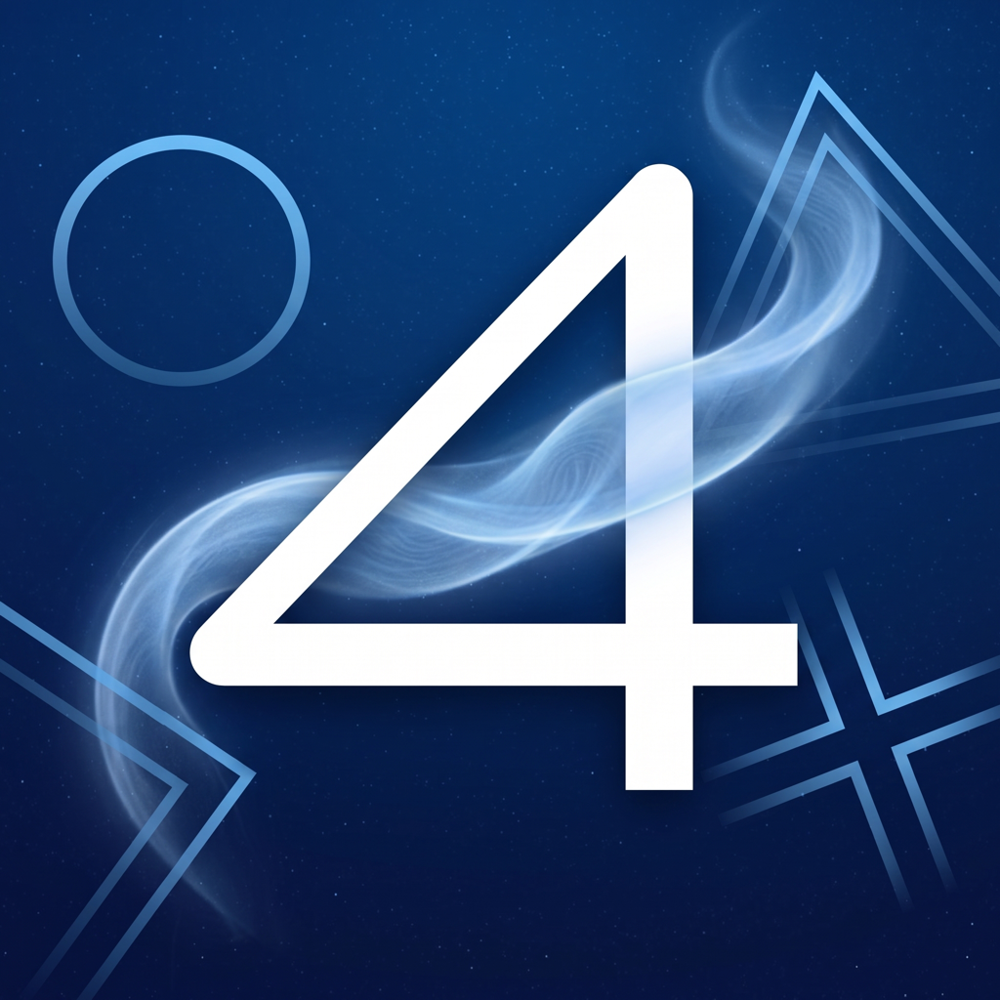

<p align="center">
  
</p>

# AetherPS4

Experimental PlayStation 4 emulation for iOS, built on [shadPS4](https://github.com/shadps4-emu/shadPS4)
with an ARM64-ported [FEXCore](https://github.com/FEX-Emu/FEX) x86-64 → ARM64 JIT and a native
SwiftUI front end. v1.0.0 targets external (MFi/Bluetooth) game controllers only.

## Supported games

Reflects games actually tried on-device so far, not a target list -- compatibility work is
ongoing and most titles are untested.

| Game | Status |
| --- | --- |
| Sonic Mania | Boots and runs |
| Journey | Loads, but can't progress past its first chapter transition yet |
| Minecraft: PlayStation®4 Edition | Currently being tested |

## File structure

```
.
├── AetherPS4-iOS/          Native iOS app (SwiftUI front end, Xcode project)
│   ├── Sources/
│   │   ├── App/            App entry point, AppDelegate, crash logging
│   │   ├── Models/         Game library, emulator process control, save data
│   │   └── Views/          SwiftUI screens (library, game detail, settings, console)
│   ├── Resources/
│   ├── Frameworks/
│   └── AetherPS4-iOS.xcodeproj
│
├── android/BachataS4/      Android app (Kotlin/Compose front end)
│
├── launcher/AetherPS4/     Standalone macOS launcher (Swift package)
│
├── src/                    shadPS4 emulator core (shared across all platforms)
│   ├── core/                Kernel/HLE emulation, memory management, signal handling
│   │   ├── fex/                FEXCore guest-engine integration (signal handling, unaligned access)
│   │   ├── guest_cpu/           Guest CPU abstraction / HLE call bridging
│   │   ├── ios/                 iOS-specific JIT allocator (dual-mapped RW/RX memory)
│   │   └── libraries/            PS4 system library (libkernel, libSceGnmDriver, etc.) implementations
│   ├── video_core/          Vulkan renderer (MoltenVK on Apple platforms)
│   ├── shader_recompiler/   GCN/RDNA shader → SPIR-V recompiler
│   ├── input/                Controller/keyboard/mouse input handling
│   ├── imgui/                ImGui-based debug UI and mobile overlay
│   └── platform/             Per-platform integration glue (ios/, bachata/, ...)
│
├── runtime/
│   ├── sources/
│   │   ├── fexcore-darwin/     FEXCore fork, ported to run on Apple ARM64 hosts (used by iOS/macOS)
│   │   ├── fex/                 Upstream FEXCore source (used by other platform targets)
│   │   └── box64/                Box64 (used for Android/Linux x86 support)
│   ├── probes/               Standalone build smoke-test programs
│   └── scripts/               Build/packaging scripts (e.g. build-ipa.sh)
│
├── externals/               Third-party dependencies (git submodules: SDL3, Vulkan headers,
│                             glslang, spdlog, FFmpeg, etc.)
│
├── tools/                    Auxiliary tools (PKG extraction, etc.)
├── docs/, documents/         Documentation
├── cmake/                     CMake helper modules
├── CMakeLists.txt             Top-level build configuration (desktop, Android, iOS targets)
└── PORTING.md                  Notes on porting shadPS4 to new platforms
```

## Building

See `PORTING.md` for platform-porting notes and `runtime/scripts/build-ipa.sh` for how the iOS
`.ipa` is built and packaged. The iOS app requires an external JIT-granting mechanism
(StikDebug or similar) since sideloaded iOS apps cannot request the `MAP_JIT` entitlement.

## License

See `LICENSE` and `LICENSES/` (shadPS4 core is GPL-2.0-or-later; see `REUSE.toml` for
per-component licensing).
